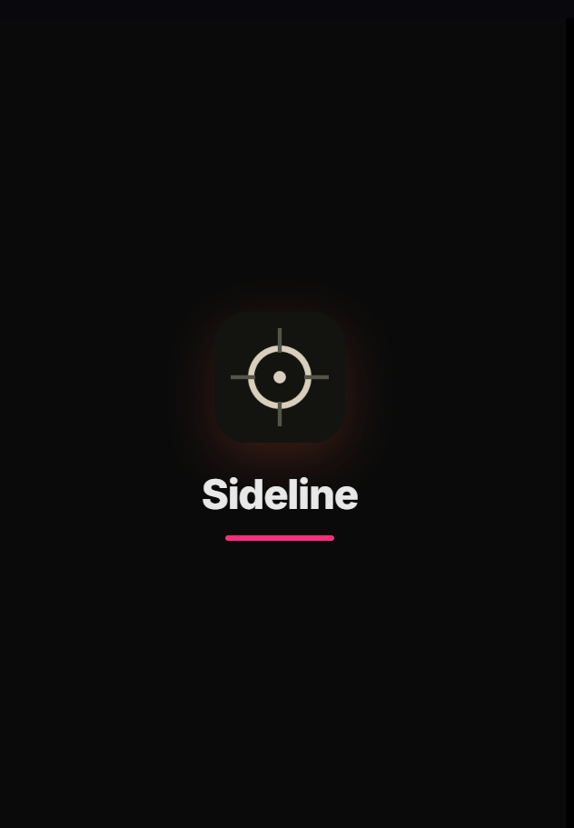
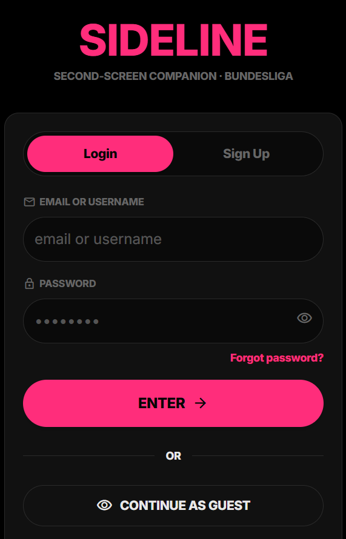
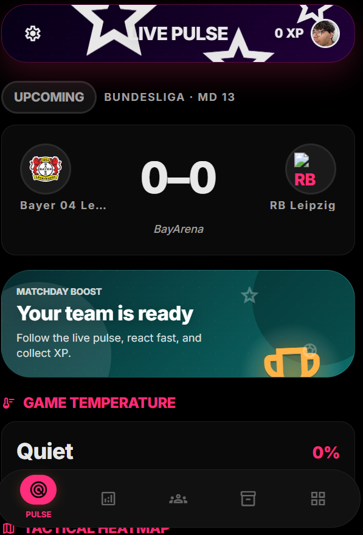
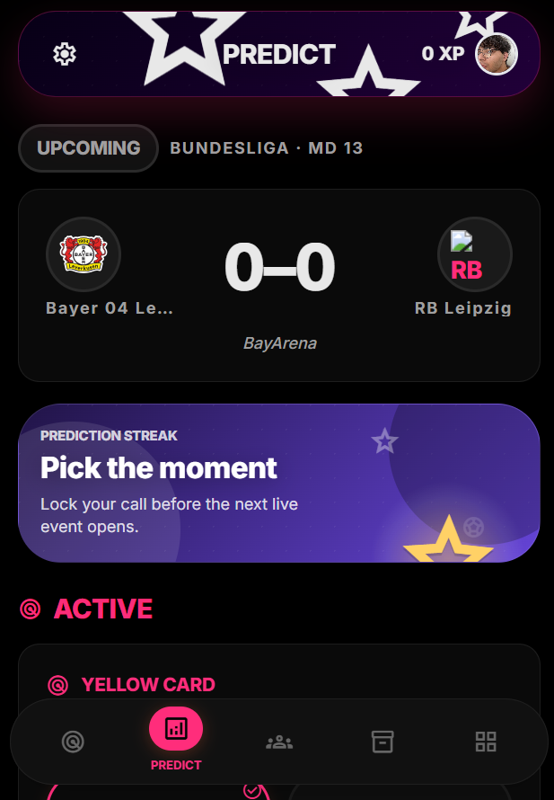
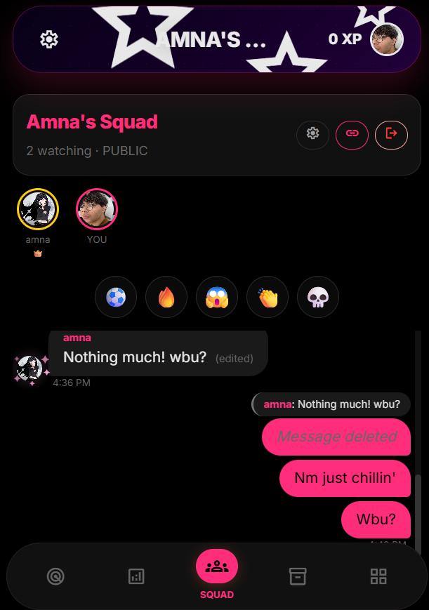

# Sideline — Real-time Second-Screen Companion for Bundesliga

Sideline is a mobile-first progressive web app (PWA) that brings live Bundesliga matches to a second-screen experience: match events, realtime predictions, collectible vault items, squad chat, and leaderboards. This README is tailored for competition judges and contributors — concise, professional, and demo-ready.

Table of Contents
- [Overview](#overview)
- [Features](#features)
- [Screenshots](#screenshots)
- [Quick Start](#quick-start)
- [Architecture & Data Flow](#architecture--data-flow)
- [Development](#development)
- [Contributing](#contributing)
- [License](#license)

Overview
--------
Sideline focuses on engaging fans during live matches with low-latency interactions and visual collectible rewards. It was designed for mobile-first demos (390px target) and supports both a reproducible simulator for demos and real feeds in production.

Features
--------
- Reproducible match simulator (configurable speed; demo-ready at 30×)
- Socket.io-based realtime events scoped by match rooms
- Prediction system with resolution and XP awards
- Vault collectibles (mint hooks for special events)
- Squad chat with emoji reactions and message moderation

App Preview
-----------
The gallery below is curated for a preview of the app. — each image has a short caption explaining the context.

- Splash / Launch — app brand and loading state

  <div align="center">
    
  </div>

- Login / Auth — email sign-in + guest mode for quick demos

  <div align="center">
    
  </div>

- Home / Predict — active match, upcoming events, prediction card CTA

  <div align="center">
    
  </div>

- Squad Chat — realtime squad chat with reactions and pinned controls

  <div align="center">
    
  </div>

- Live Pulse — match temperature, tactical heatmap, and live indicators

  <div align="center">
    
  </div>

Quick Start
-----------
Prerequisites
- Node.js 18+ (LTS recommended)
- npm

Install

```bash
npm install
npm --prefix client install
npm --prefix server install
```

Run (development)

```bash
# server (hot reload)
npm --prefix server run dev

# client (Vite dev server)
npm --prefix client run dev
```

Run the replay simulator (demo)

```bash
# start server with auto-simulate (demo timeline)
AUTO_SIMULATE=1 npm --prefix server run dev
```

Architecture & Data Flow
-----------------------
- Frontend: React 18 + Vite, Tailwind CSS, Zustand for global state
- Backend: Node 18+, Express 4, Socket.io 4
- Persistence: Supabase (production) with optional RDS/Postgres; in-memory fallback for demos

Realtime model
- Socket.io rooms per match: clients join `match:<id>`
- Events: `match:update`, `match:event`, `match:goal`, `prediction:new`, `prediction:resolved`, `leaderboard:update`, `vault:minted`, `vault:supply_update`

Development Notes
-----------------
- ESM everywhere (`"type": "module"`)
- Keep all service keys out of the repo (never commit `.env` or service-role keys)
- Use the in-memory DB for offline demos — toggle with `AUTO_SIMULATE`

Contributing
------------
- Branch naming: `feat/`, `fix/`, `chore/`, `refactor/`, `docs/`
- Tests: client uses Vitest; server uses `node --test` + Supertest
- When opening a PR: include a short demo checklist and a screenshot/GIF of the key flow changed

License
-------
MIT — add `LICENSE` at the repo root to make this explicit.

Acknowledgements
---------------
Built for demo and competition use — designed for quick, reproducible presentations.

--
For more context and session notes see `CLAUDE.md` and `CONTEXT.md`.
